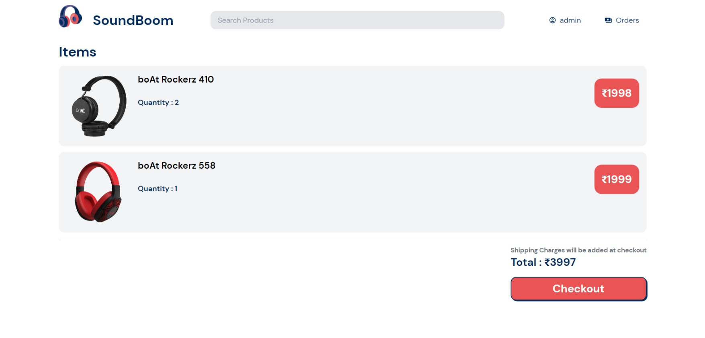
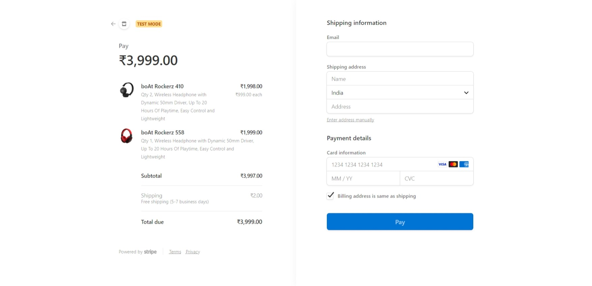
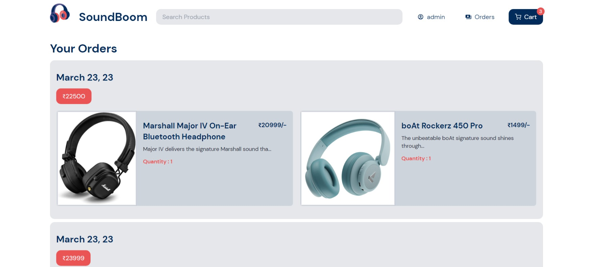

# SoundBoom_MERN_Ecommerce


The SoundBoom MERN Ecommerce repository contains the source code for an ecommerce web application built using the MERN stack. It includes a client folder for the React frontend and a api folder for the Node.js backend. The project utilizes MongoDB for data storage and management, Express for building the API, React for building the user interface, and Node.js for server-side development. The project includes features such as user authentication, shopping cart management, payment integration with Stripe, and search and filter functionality. The code is well-organized and includes comments for easy comprehension.


## Run Locally

Clone the project


```bash
  git clone https://github.com/Mehulparekh144/SoundBoom_MERN_Ecommerce.git
  cd project-folder
```

For frontend vite + reactjs
```
  cd client
  npm run dev
```

For backend 
```
  cd api
  nodemon index.js
```
## Demo

Insert gif or link to demo


## Screenshots







## Authors

- [@Mehulparekh144](https://www.github.com/Mehulparekh144)


## Environment Variables

To run this project, you will need to create .env file in api folder and  add the following environment variables to your .env file  

`MONGO_URL` you can get this using mongodb atlas

`SECRET_KEY` any random text

`STRIPE_SECRET_KEY ` You can get this from stripe

`STRIPE_PUBLISH_KEY ` You can get this from stripe
## Feedback

If you have any feedback, please reach out to us at mehulparekh144@.com


## Tech Stack

**Client:** React, Vite , TailwindCSS

**Server:** Node, Express , MongoDB 

**Deployment:** Vercel 

**Payment** : Stripe

